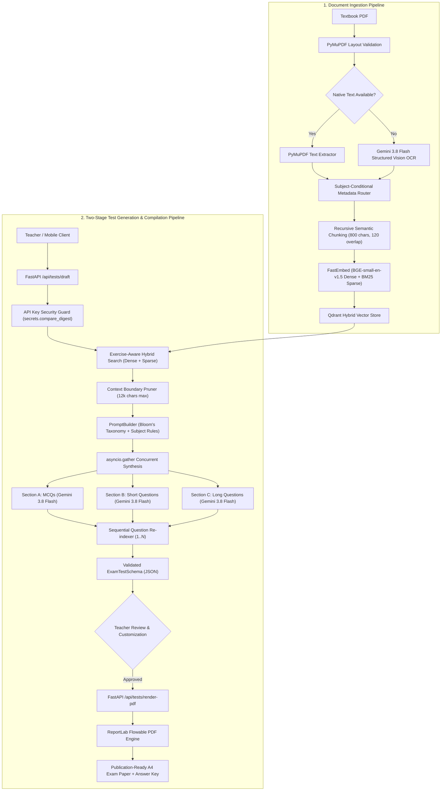

[← Back to Main ExamCraft Monorepo](../README.md)

# ExamCraft AI — Backend Assessment Engine & RAG Subsystem

[](https://www.python.org/)
[](https://fastapi.tiangolo.com)
[](https://qdrant.tech)
[](https://deepmind.google/technologies/gemini/)
[](tests/)
[](https://docs.pydantic.dev/)
[](https://opensource.org/licenses/MIT)

> **Zero-hallucination, curriculum-grounded examination paper generation engine and high-performance vector retrieval backend. Built with FastAPI, Qdrant Hybrid Search (Dense BGE + Sparse BM25), Instructor-enforced Gemini 3.8 Flash, and ReportLab PDF compilation.**

---

## Table of Contents

- [1. Executive Overview](#1-executive-overview)
  - [Role in the ExamCraft AI Ecosystem](#role-in-the-examcraft-ai-ecosystem)
  - [The Zero-Hallucination Grounding Philosophy](#the-zero-hallucination-grounding-philosophy)
- [2. Key Capabilities & Feature Matrix](#2-key-capabilities--feature-matrix)
- [3. System Architecture & Data Flow](#3-system-architecture--data-flow)
- [4. Technology Stack & Dependencies](#4-technology-stack--dependencies)
- [5. Repository Structure & Module Tour](#5-repository-structure--module-tour)
- [6. Local Developer Setup](#6-local-developer-setup)
  - [Prerequisites](#prerequisites)
  - [Step-by-Step Installation](#step-by-step-installation)
  - [Running with Docker Compose](#running-with-docker-compose)
  - [Interactive Documentation](#interactive-documentation)
- [7. Environment Variables Reference](#7-environment-variables-reference)
- [8. REST API Specification & Interface Contracts](#8-rest-api-specification--interface-contracts)
  - [Security & Authentication Scheme](#security--authentication-scheme)
  - [GET /api/health](#get-apihealth)
  - [GET /api/subjects](#get-apisubjects)
  - [GET /api/subjects/{subject}/chapters](#get-apisubjectssubjectchapters)
  - [GET /api/subjects/{subject}/chapters/{chapter}/metadata](#get-apisubjectssubjectchapterschaptermetadata)
  - [POST /api/tests/draft](#post-apitestsdraft)
  - [POST /api/tests/render-pdf](#post-apitestsrender-pdf)
  - [POST /api/admin/upload-textbook](#post-apiadminupload-textbook)
  - [GET /api/admin/jobs/{job_id}/stream (SSE)](#get-apiadminjobsjob_idstream-sse)
  - [Legacy Compatibility Routes](#legacy-compatibility-routes)
- [9. Technical Decisions & Core Architecture](#9-technical-decisions--core-architecture)
  - [Hybrid Vector Retrieval (BGE Dense + BM25 Sparse)](#hybrid-vector-retrieval-bge-dense--bm25-sparse)
  - [Subject-Conditional Metadata Routing](#subject-conditional-metadata-routing)
  - [Section-Parallel Synthesis (`asyncio.gather`)](#section-parallel-synthesis-asynciogather)
  - [Context Boundary Pruning (12,000 Chars)](#context-boundary-pruning-12000-chars)
  - [Strict Zero-Placeholder Policy](#strict-zero-placeholder-policy)
  - [ReportLab Flowable Typography & Math Tags](#reportlab-flowable-typography--math-tags)
- [10. Testing & Verification Suite](#10-testing--verification-suite)
  - [Running the Test Suites](#running-the-test-suites)
  - [68/68 Test Breakdown Across 11 Test Files](#6868-test-breakdown-across-11-test-files)
  - [Adversarial & Concurrency Hardening](#adversarial--concurrency-hardening)
- [11. Production Deployment & Operations](#11-production-deployment--operations)
- [12. AI Disclosure & Licensing](#12-ai-disclosure--licensing)

---

## 1. Executive Overview

### Role in the ExamCraft AI Ecosystem

The **ExamCraft AI Backend** serves as the intelligence and document processing core of the ExamCraft monorepo. It powers both the **Flutter 3 cross-platform mobile client** and the **Next.js 15 Web Assessment Studio**, delivering:

1. **Sub-second hybrid vector search** across official Punjab Textbook Board (PTB) and Federal Board curriculum textbooks.
2. **Deterministic, structured test paper drafting** powered by Google DeepMind's **Gemini 3.8 Flash** via Instructor and OpenAI-compatible gateways.
3. **High-fidelity PDF document rendering** producing print-ready examination papers with customizable headers, institutional watermarks, bilingual tables, and separate teacher marking schemes.
4. **Resilient document ingestion** featuring PyMuPDF parsing, Gemini structured vision OCR fallback, recursive chunking, and real-time Server-Sent Events (SSE) telemetry.

```
┌────────────────────────────────────────────────────────┐
│           Client Layer: Flutter Mobile & Next.js Web   │
└───────────────────────────┬────────────────────────────┘
                            │ HTTP / JSON / SSE (X-API-Key)
                            ▼
┌────────────────────────────────────────────────────────┐
│           ExamCraft AI Backend (FastAPI Subsystem)     │
│  ┌────────────────────┐      ┌──────────────────────┐  │
│  │   Routers & Auth   │      │  PromptBuilder & LLM │  │
│  └─────────┬──────────┘      └──────────┬───────────┘  │
│            ▼                            ▼              │
│  ┌────────────────────┐      ┌──────────────────────┐  │
│  │ VectorStoreService │      │  ReportLab PDF Gen   │  │
│  └─────────┬──────────┘      └──────────────────────┘  │
└────────────┼───────────────────────────────────────────┘
             │ Dense (384d) + Sparse (BM25)
             ▼
┌────────────────────────────────────────────────────────┐
│        Qdrant Hybrid Vector DB (Cloud / Local)         │
└────────────────────────────────────────────────────────┘
```

### The Zero-Hallucination Grounding Philosophy

Secondary school academic testing in Pakistan (Classes 9, 10, 11, and 12) demands **absolute syllabus adherence**. If an AI test generator invents terminology, pulls formulas from unapproved foreign curricula, or devises distractors absent from textbook context, students are marked down and teacher trust evaporates.

ExamCraft AI solves this through strict **Zero-Hallucination Textbook Grounding**:
* **Every MCQ requires an exact textbook excerpt citation (`textbook_reference`)**: The model must provide verbatim evidence from the retrieved textbook context validating why the selected option is correct.
* **Zero Dummy Fallbacks**: If textbook context is missing for a requested chapter, the backend rejects the request with HTTP `404 ContextNotFound`. It will **never** generate fabricated or placeholder questions (`"Sample MCQ"`, `"Choice Alpha"`, `"Lorem ipsum"`).
* **Curriculum Boundaries**: All questions are bounded by Bloom's Taxonomy cognitive levels (Easy, Medium, Hard, Mixed) and calibrated against official Board examination mark schemes (1 mark for MCQs, 2 marks for Short Questions, 5 marks for Long Questions).

---

## 2. Key Capabilities & Feature Matrix

| Capability | Technical Mechanism | Benefit / Production Impact |
| :--- | :--- | :--- |
| **Grounded Test Drafting** | Instructor + Gemini 3.8 Flash Pydantic v2 schemas | Guarantees 100% textbook-cited questions; zero out-of-syllabus hallucinations. |
| **Hybrid Vector Retrieval** | BAAI/bge-small-en-v1.5 (dense) + Qdrant BM25 (sparse) with IDF | Delivers semantic depth and exact keyword match (scientific terms, formulas). |
| **Two-Stage Workflow** | Stage 1: JSON draft creation<br>Stage 2: ReportLab PDF compilation | Enables teachers to edit, add, or prune questions before producing physical exams. |
| **Section-Parallel Synthesis** | Concurrent coroutines via `asyncio.gather` | Reduces multi-section generation latency from ~35s down to ~8–12s. |
| **Sequential Re-indexing** | Dynamic question numbering pipeline (1..N) | Merges disparate section results seamlessly while computing total marks and exam duration. |
| **Subject-Conditional Routing** | Regex exercise router for Math; clean 0-rule for Science | Prevents false-positive exercise collisions in Chemistry, Physics, Biology, and CS textbooks. |
| **Context Boundary Pruning** | 12,000 character window with paragraph & tag awareness | Protects LLM context window while preserving chemical and math notation (`H<sub>2</sub>O`, `x<sup>2</sup>`). |
| **Multi-Tier OCR Pipeline** | PyMuPDF → Gemini 3.8 Flash Vision OCR → RapidOCR local ONNX | Ingests pristine digital textbooks and legacy scanned PDF prints with equal fidelity. |
| **Real-Time Job Telemetry** | Server-Sent Events (SSE) via `JobManager` | Eliminates client gateway timeouts on 100+ page textbook uploads; streams live progress. |
| **Enterprise Security Guard** | Constant-time `secrets.compare_digest` + OWASP headers | Defends against timing attacks, clickjacking, MIME-sniffing, and cross-site leaks. |

---

## 3. System Architecture & Data Flow

The following diagram illustrates the validated, end-to-end data lifecycle across document ingestion, vector retrieval, concurrent section synthesis, and PDF compilation:



---

## 4. Technology Stack & Dependencies

All dependencies are pinned and verified against Python 3.12:

| Component | Pinned Version | Architectural Role & Rationale |
| :--- | :--- | :--- |
| **FastAPI** | `>=0.115.0` | Asynchronous, high-throughput ASGI web framework with native OpenAPI contract generation. |
| **Uvicorn** | `[standard]>=0.30.0` | Production ASGI web server with uvloop and httptools performance optimizations. |
| **Pydantic & Settings** | `>=2.8.0`, `>=2.4.0` | Strict data validation, schema enforcement, and centralized `.env` configuration. |
| **Qdrant Client** | `>=1.10.0` | Official Python client for Qdrant Hybrid Vector Search with custom payload indices. |
| **FastEmbed** | `>=0.3.4` | High-efficiency, in-process embedding engine generating BGE dense and BM25 sparse vectors. |
| **Instructor** | `>=1.4.0` | Enforces structured JSON output and Pydantic validation onto LLM completions. |
| **OpenAI Python SDK** | `>=1.40.0` | Async client powering OmniRoute and OpenAI-compatible endpoints with custom base URLs. |
| **Google GenAI SDK** | `>=0.1.1` | Native Google Generative AI SDK for direct Gemini vision OCR extraction. |
| **ReportLab** | `>=4.2.0` | Industrial-grade PDF compilation engine creating custom flowables, tables, and typography. |
| **PyMuPDF (fitz)** | `>=1.24.0` | High-speed PDF text extraction, document inspection, page layout analysis, and pixmap rendering. |
| **RapidOCR ONNX** | `>=1.3.0` | Local ONNX runtime fallback for optical character recognition without external API calls. |
| **LangChain Core & Splitters** | `>=0.2.0` | Document data abstractions and `RecursiveCharacterTextSplitter` with curriculum separators. |
| **HTTPX** | `>=0.27.0` | Async HTTP client for outbound network telemetry, health checks, and gateway testing. |
| **Pytest & Asyncio** | `>=8.3.0`, `>=0.24.0` | Test runner and async testing engine backing the 68-test automated verification suite. |

---

## 5. Repository Structure & Module Tour

```
backend/
├── core/                               # Core application infrastructure & cross-cutting concerns
│   ├── config.py                       # Pydantic BaseSettings loading from .env (centralized settings)
│   ├── curriculum.py                   # Canonical Punjab & Federal Board curriculum definitions (Grades 9-12)
│   ├── exceptions.py                   # Domain exceptions (ContextNotFound, InvalidRequest) & JSON handlers
│   ├── lifespan.py                     # FastAPI lifespan context manager (Qdrant client init & cleanup)
│   ├── logger.py                       # Structured logging configuration with ISO timestamps
│   ├── middleware.py                   # Request ID tracking, latency measurement & OWASP security headers
│   └── security.py                     # API key authentication guard with timing attack resistance
│
├── routers/                            # API endpoints & request controllers
│   ├── generation.py                   # POST /api/tests/draft (Context retrieval + LLM synthesis)
│   ├── health.py                       # GET /api/health (System status, uptime, Qdrant latency check)
│   ├── metadata.py                     # GET /api/subjects (Dynamic subject & chapter discovery)
│   ├── pdf_router.py                   # POST /api/tests/render-pdf (ReportLab binary PDF stream)
│   └── upload.py                       # POST /api/admin/upload-textbook & SSE live job stream
│
├── schemas/                            # Pydantic contracts & domain models
│   ├── exam_enums.py                   # Enums: SubjectEnum, RetrievalModeEnum, DifficultyEnum
│   ├── exam_schema.py                  # Class9TestSchema, ExamTestSchema, MCQItem, Section[A,B,C]Response
│   ├── request_schemas.py              # TestGenerationRequest, PDFRenderRequest
│   └── response_schemas.py             # HealthResponse, SubjectListResponse, ChapterListResponse, UploadResponse
│
├── services/                           # Business logic & AI orchestration
│   ├── job_manager.py                  # In-memory background ingestion worker & SSE event dispatcher
│   ├── llm_service.py                  # Section-parallel Instructor LLM invocation with Gemini 3.8 Flash
│   ├── metadata_extractor.py           # Subject-conditional rule engine (Math exercises vs clean Science)
│   ├── ocr_service.py                  # Gemini 3.8 Flash structured vision OCR + RapidOCR ONNX fallback
│   ├── pdf_generator.py                # ReportLab A4 document layout, 2x2 MCQ grids & marking schemes
│   ├── pdf_processor.py                # PyMuPDF document extraction, semantic chunking & cleaning
│   ├── prompt_builder.py               # Modular prompt construction with Bloom's Taxonomy & subject rules
│   └── vector_store_service.py         # Hybrid search, Qdrant indexing, facet aggregation & TTL caches
│
├── tests/                              # Automated test suite (68/68 Passed)
│   ├── conftest.py                     # Mock fixtures (Qdrant client, TestClient, OCR stubs)
│   ├── run_adversarial_suite.py        # Runner for adversarial edge cases and benchmarks
│   ├── run_all_backend_suites.py       # Master regression runner across all 10 domain suites
│   ├── test_adversarial_challenger.py  # Zero-placeholder policy & error boundary verification (9 tests)
│   ├── test_concurrency_llm.py         # asyncio.gather parallel timing & question re-indexing (4 tests)
│   ├── test_context_pruning.py         # 12,000 char boundary hierarchy & tag preservation (5 tests)
│   ├── test_endpoints.py               # Generation, rendering, and upload route integration (7 tests)
│   ├── test_health.py                  # Health telemetry endpoint validation (1 test)
│   ├── test_metadata.py                # Subject & chapter querying with grade isolation (3 tests)
│   ├── test_prompt_harness.py          # Prompt construction, ordering, and section prompts (6 tests)
│   ├── test_security.py                # Auth guard, OWASP headers, magic bytes, RBAC (9 tests)
│   ├── test_subject_conditional_pipeline.py # Math vs Science routing & prompt rules (15 tests)
│   ├── test_validation.py              # Pydantic schema validation & grade boundaries (5 tests)
│   ├── test_zero_placeholder.py        # Rejection of fake tokens & mock questions (4 tests)
│   └── verify_all.py                   # End-to-end smoke verification runner
│
├── temp_uploads/                       # Temporary staging directory for uploaded textbooks (.gitkeep)
├── .env.example                        # Template environment variables file
├── .gitignore                          # Git ignore rules for virtualenvs, caches, and secrets
├── Dockerfile                          # Multi-stage production container build (python:3.12-slim)
├── docker-compose.yml                  # One-click multi-service stack (FastAPI + Qdrant Vector DB)
├── main.py                             # FastAPI application entry point & router registration
├── pytest.ini                          # Pytest configuration (testpaths, async mode, options)
├── requirements.txt                    # Pinned Python package dependencies
└── README.md                           # Comprehensive backend subsystem documentation
```

---

## 6. Local Developer Setup

### Prerequisites

* **Python 3.12+** installed on your system.
* **Docker Desktop** (or a remote [Qdrant Cloud](https://cloud.qdrant.io/) cluster).
* **Gemini API Key** (from [Google AI Studio](https://aistudio.google.com/)) or an OpenAI-compatible gateway key.

---

### Step-by-Step Installation

#### 1. Clone & Navigate to Backend
```bash
git clone https://github.com/mubashir-sohail-dev/ExamCraft.git
cd ExamCraft/backend
```

#### 2. Create and Activate Virtual Environment

* **On Linux / macOS:**
  ```bash
  python3.12 -m venv .venv
  source .venv/bin/activate
  ```

* **On Windows (PowerShell):**
  ```powershell
  python -m venv .venv
  .\.venv\Scripts\Activate.ps1
  ```

#### 3. Install Python Dependencies
```bash
pip install --upgrade pip
pip install -r requirements.txt
```

#### 4. Configure Environment Variables
Copy the example environment configuration:
```bash
cp .env.example .env
```
Open `.env` in your editor and configure your credentials:
```env
# Required credentials
LLM_API_KEY=your_gemini_api_key_here
LLM_MODEL_NAME=gemini-3.8-flash

# Qdrant Database (Local Docker default)
QDRANT_URL=http://localhost:6333
COLLECTION_NAME=class_9_textbooks

# API Security Keys
API_KEY=examcraft-secret-key-2026
ADMIN_API_KEY=examcraft-admin-key-2026
```

#### 5. Launch Local Qdrant via Docker
If running Qdrant locally, start the official container:
```bash
docker run -d --name examcraft-qdrant \
  -p 6333:6333 \
  -p 6334:6334 \
  -v qdrant_storage:/qdrant/storage \
  qdrant/qdrant:latest
```
Verify Qdrant is running by visiting: [http://localhost:6333/dashboard](http://localhost:6333/dashboard).

#### 6. Start the FastAPI Development Server
```bash
uvicorn main:app --host 0.0.0.0 --port 8000 --reload
```

---

### Running with Docker Compose

For a one-command setup running both the FastAPI backend and Qdrant in isolated containers:
```bash
docker compose up --build -d
```
To view logs:
```bash
docker compose logs -f api
```
To stop the stack:
```bash
docker compose down
```

---

### Interactive Documentation

Once the backend is running, explore and test all API contracts interactively:
* **Swagger UI (OpenAPI)**: [http://localhost:8000/docs](http://localhost:8000/docs)
* **ReDoc Documentation**: [http://localhost:8000/redoc](http://localhost:8000/redoc)

> **Testing Auth in Swagger UI**: Click the green **Authorize 🔓** button in the top right corner of `/docs` and enter `examcraft-secret-key-2026` in the `X-API-Key` field.

---

## 7. Environment Variables Reference

All application settings are managed via Pydantic Settings in `core/config.py`:

| Variable | Type | Default | Description & Production Guidance |
| :--- | :---: | :---: | :--- |
| `API_KEY` | `str` | `examcraft-secret-key-2026` | Client API key required in `X-API-Key` header for generation and metadata. |
| `ADMIN_API_KEY` | `str` | `examcraft-admin-key-2026` | Privileged API key required for textbook upload and indexing operations. |
| `ENABLE_AUTH` | `bool` | `true` | Global switch to enforce API key authentication. Set `false` for rapid local prototyping. |
| `ALLOWED_ORIGINS` | `list` | `["*"]` | Allowed CORS origins list. Set to specific frontend domains in production. |
| `QDRANT_URL` | `str` | `http://localhost:6333` | Connection URL for local Qdrant instance or Qdrant Cloud cluster. |
| `QDRANT_API_KEY` | `str` | `None` | Authentication token for managed Qdrant Cloud clusters. |
| `COLLECTION_NAME` | `str` | `class_9_textbooks` | Default primary Qdrant collection for textbook vectors. |
| `QDRANT_BATCH_SIZE` | `int` | `32` | Number of document chunks batched per upsert request to Qdrant. |
| `LLM_BASE_URL` | `str` | `""` | Base URL for OpenAI-compatible LLM endpoint or Google AI Studio gateway. |
| `LLM_API_KEY` | `str` | `""` | API key for the LLM inference provider (Gemini). |
| `GEMINI_API_KEY` | `str` | `None` | Direct Google Gemini API key used by Google GenAI vision OCR pipeline. |
| `LLM_MODEL_NAME` | `str` | `gemini-3.8-flash` | LLM model identifier. Strictly set to `gemini-3.8-flash`. |
| `MAX_CONTEXT_CHARS` | `int` | `12000` | Maximum character budget for retrieved RAG context passed to the LLM. |
| `DENSE_MODEL_NAME` | `str` | `BAAI/bge-small-en-v1.5` | FastEmbed dense embedding model identifier (384 dimensions). |
| `SPARSE_MODEL_NAME` | `str` | `Qdrant/bm25` | FastEmbed sparse lexical embedding model identifier for keyword matching. |
| `UPLOAD_DIR` | `str` | `temp_uploads` | Directory for temporary staging files during PDF document ingestion. |
| `PDF_TEMP_DIRECTORY` | `str` | `temp_uploads` | Alias to `UPLOAD_DIR` ensuring backward compatibility. |
| `MAX_UPLOAD_SIZE_MB` | `int` | `1000` | Maximum allowable file size for textbook PDF uploads (in megabytes). |
| `LOG_LEVEL` | `str` | `INFO` | Application log verbosity (`DEBUG`, `INFO`, `WARNING`, `ERROR`). |

---

## 8. REST API Specification & Interface Contracts

### Security & Authentication Scheme

All endpoints except `/api/health`, `/docs`, and `/redoc` enforce API key verification passed via request headers:

```http
X-API-Key: examcraft-secret-key-2026
```

* **Client Operations** (`/api/subjects`, `/api/tests/draft`, `/api/tests/render-pdf`): Accept either `API_KEY` or `ADMIN_API_KEY`.
* **Admin Operations** (`/api/admin/upload-textbook`): Strictly require `ADMIN_API_KEY`. Missing or client keys return `403 Forbidden`.
* **Timing Protection**: Tokens are validated using `secrets.compare_digest` in `core/security.py`.

---

### GET /api/health

Verifies backend operational status, uptime, Qdrant latency, and LLM readiness.

* **Headers**: None (Public)
* **Status**: `200 OK`

```json
{
  "status": "ok",
  "qdrant_connected": true,
  "version": "1.0.0",
  "environment": "production",
  "uptime_seconds": 341.25,
  "timestamp": "2026-10-04T17:30:00.000000+00:00",
  "qdrant_latency_ms": 6.84,
  "collection_exists": true,
  "llm_available": true
}
```

---

### GET /api/subjects

Returns the list of supported curriculum subjects. Cached with `Cache-Control: public, max-age=3600`.

* **Headers**: `X-API-Key: examcraft-secret-key-2026`
* **Status**: `200 OK`

```json
{
  "subjects": [
    "Chemistry",
    "Physics",
    "Mathematics",
    "Biology",
    "Computer Science"
  ]
}
```

---

### GET /api/subjects/{subject}/chapters

Retrieves genuine chapter names extracted directly from indexed Qdrant textbook vectors for the specified subject and educational grade.

* **Headers**: `X-API-Key: examcraft-secret-key-2026`
* **Query Parameters**:
  * `grade` (`int`, optional, default: `9`, range: `9..12`): Target educational grade.
* **Status**: `200 OK`

```json
{
  "subject": "Chemistry",
  "chapters": [
    "Chapter 1: Fundamentals of Chemistry",
    "Chapter 2: Structure of Atoms",
    "Chapter 3: Periodic Table and Periodicity of Properties",
    "Chapter 4: Structure of Molecules",
    "Chapter 5: Physical States of Matter",
    "Chapter 6: Solutions",
    "Chapter 7: Electrochemistry",
    "Chapter 8: Chemical Reactivity"
  ]
}
```

---

### GET /api/subjects/{subject}/chapters/{chapter}/metadata

Retrieves dynamic exercises, sections, and topics for a specific chapter from Qdrant vector payloads.
> **Subject-Conditional Behavior**: For non-Math subjects (e.g. Chemistry, Physics), this endpoint immediately short-circuits and returns empty arrays without querying Qdrant, guaranteeing clean chapter-level schemas.

* **Headers**: `X-API-Key: examcraft-secret-key-2026`
* **Query Parameters**: `grade` (`int`, optional, default: `9`)
* **Status**: `200 OK`

```json
{
  "subject": "Mathematics",
  "chapter": "Chapter 1: Matrices and Determinants",
  "exercises": [
    "Exercise 1.1",
    "Exercise 1.2",
    "Exercise 1.3",
    "Review Exercise 1"
  ],
  "sections": [
    "Section 1.1",
    "Section 1.2"
  ],
  "topics": [
    "Order of a Matrix",
    "Determinant of a 2x2 Matrix"
  ]
}
```

---

### POST /api/tests/draft

Retrieves textbook context from Qdrant and concurrently synthesizes a zero-hallucination structured test JSON paper.

* **Headers**:
  * `Content-Type: application/json`
  * `X-API-Key: examcraft-secret-key-2026`
* **Status**: `200 OK`

#### Request Payload:
```json
{
  "subject": "Chemistry",
  "grade": 9,
  "chapter_name": "Chapter 5: Physical States of Matter",
  "test_type": "topic",
  "topic_query": "States of Matter and Kinetic Molecular Theory",
  "mcq_count": 3,
  "short_count": 2,
  "long_count": 1,
  "difficulty": "medium",
  "include_answer_key": true,
  "generation_instruction": "Focus on kinetic molecular theory and gas behavior."
}
```

#### Response (200 OK):
```json
{
  "test_title": "Class 9 Chemistry - States of Matter and Kinetic Molecular Theory Assessment",
  "subject": "Chemistry",
  "grade": 9,
  "chapter_or_topic": "States of Matter and Kinetic Molecular Theory",
  "total_marks": 12,
  "time_allowed": "30 Minutes",
  "instructions": [
    "Attempt all questions.",
    "Write neatly and draw diagrams where necessary."
  ],
  "mcqs": [
    {
      "question_number": 1,
      "question": "According to kinetic molecular theory, particles of matter are in constant:",
      "options": [
        "A) Random motion",
        "B) Circular motion",
        "C) Stationary state",
        "D) Vibrational state only in gases"
      ],
      "correct_option": "A",
      "textbook_reference": "Particles of matter possess kinetic energy and are in continuous random motion (PTB Chemistry Ch 5, Page 84)."
    },
    {
      "question_number": 2,
      "question": "Which physical state of matter possesses a definite volume but no fixed shape?",
      "options": [
        "A) Solid",
        "B) Liquid",
        "C) Gas",
        "D) Plasma"
      ],
      "correct_option": "B",
      "textbook_reference": "Liquids have fixed volume but take the shape of their container (PTB Chemistry Ch 5, Page 85)."
    },
    {
      "question_number": 3,
      "question": "The temperature at which vapor pressure of a liquid equals atmospheric pressure is its:",
      "options": [
        "A) Melting point",
        "B) Boiling point",
        "C) Critical point",
        "D) Triple point"
      ],
      "correct_option": "B",
      "textbook_reference": "Boiling point is the temperature at which vapor pressure equals external atmospheric pressure (PTB Chemistry Ch 5, Page 91)."
    }
  ],
  "short_questions": [
    {
      "question_number": 4,
      "question": "Define sublimation and provide one common example from the textbook.",
      "marks": 2
    },
    {
      "question_number": 5,
      "question": "Explain why gases are compressible while solids are virtually incompressible.",
      "marks": 2
    }
  ],
  "long_questions": [
    {
      "question_number": 6,
      "question": "State Boyle's Law. State its mathematical formulation and describe an experiment to verify it.",
      "marks": 5
    }
  ]
}
```

---

### POST /api/tests/render-pdf

Converts approved `Class9TestSchema` / `ExamTestSchema` JSON into a publication-ready, print-formatted A4 PDF document stream.

* **Headers**:
  * `Content-Type: application/json`
  * `X-API-Key: examcraft-secret-key-2026`
* **Request Payload**:
```json
{
  "test_data": {
    "test_title": "Class 9 Chemistry Assessment",
    "subject": "Chemistry",
    "grade": 9,
    "chapter_or_topic": "Chapter 5: Physical States of Matter",
    "total_marks": 12,
    "time_allowed": "30 Minutes",
    "instructions": ["Attempt all questions."],
    "mcqs": [...],
    "short_questions": [...],
    "long_questions": [...]
  },
  "include_answer_key": true
}
```
* **Status**: `200 OK`
* **Response**: `application/pdf` binary stream
* **Header**: `Content-Disposition: attachment; filename="Chemistry_Grade9_Test.pdf"`

---

### POST /api/admin/upload-textbook

Dispatches asynchronous background ingestion of a textbook PDF. Returns immediate `HTTP 202 Accepted` to eliminate HTTP timeouts on heavy PDF uploads.

* **Headers**:
  * `Content-Type: multipart/form-data`
  * `X-API-Key: examcraft-admin-key-2026` *(Requires Admin Key)*
* **Form Fields**:
  * `file`: PDF document binary (`%PDF` magic byte verified)
  * `subject`: `"Chemistry" | "Physics" | "Mathematics" | "Biology" | "Computer Science"`
  * `grade`: `9 | 10 | 11 | 12`
  * `chapter_name`: *(Optional)* Chapter override string
* **Status**: `202 Accepted`

```json
{
  "job_id": "job_315cc36620de",
  "status": "queued",
  "filename": "Class9_Chemistry_PTB.pdf",
  "subject": "Chemistry",
  "grade": 9,
  "message": "Ingestion job queued successfully. Connect to SSE stream for live progress.",
  "stream_url": "/api/admin/jobs/job_315cc36620de/stream",
  "status_url": "/api/admin/jobs/job_315cc36620de"
}
```

---

### GET /api/admin/jobs/{job_id}/stream (SSE)

Establishes a Server-Sent Events (SSE) connection streaming real-time extraction, chunking, embedding, and indexing progress.

* **Headers**: `X-API-Key: examcraft-admin-key-2026`
* **Response**: `text/event-stream`

```
data: {"job_id": "job_315cc36620de", "status": "extracting", "progress_percent": 25, "current_page": 28, "total_pages": 112, "stage_message": "Extracting Page 28 of 112 (Chapter 3: Periodic Table)..."}

data: {"job_id": "job_315cc36620de", "status": "chunking", "progress_percent": 55, "stage_message": "Generating overlapping semantic chunks with curriculum metadata..."}

data: {"job_id": "job_315cc36620de", "status": "indexing", "progress_percent": 85, "chunks_indexed": 340, "stage_message": "Upserting hybrid points into Qdrant collection 'class_9_textbooks'..."}

data: {"job_id": "job_315cc36620de", "status": "completed", "progress_percent": 100, "result": {"status": "success", "chunks_indexed": 340, "chapters_detected": 8, "duration_seconds": 14.8}}
```

---

### Legacy Compatibility Routes

For complete backward compatibility with older client builds, the following route aliases remain operational:

| Legacy Route | Modern Canonical Route | Permission |
| :--- | :--- | :--- |
| `POST /api/draft-test` | `POST /api/tests/draft` | Client (`API_KEY`) |
| `POST /api/render-pdf` | `POST /api/tests/render-pdf` | Client (`API_KEY`) |
| `POST /api/upload-textbook` | `POST /api/admin/upload-textbook` | Admin (`ADMIN_API_KEY`) |

---

## 9. Technical Decisions & Core Architecture

### Hybrid Vector Retrieval (BGE Dense + BM25 Sparse)

Traditional dense vector retrieval often fails on exact scientific terminology, chemical formula matching (`H2SO4`, `KMnO4`), and numerical exercise labels (`"Exercise 2.4 Question 3"`). Conversely, pure keyword search fails on conceptual semantic queries (`"Explain how heat transfers in solids"`).

**Solution**: The backend implements **Qdrant Hybrid Search**:
1. **Dense Vectors**: 384-dimensional semantic embeddings generated in-process via `BAAI/bge-small-en-v1.5`.
2. **Sparse Vectors**: Lexical token frequency embeddings with inverse document frequency modifiers (`Qdrant/bm25`, `models.Modifier.IDF`).
3. **Exercise-Aware Boosting**: When an exercise is specified, chunks tagged with that exercise receive a priority boost in score fusion.

---

### Subject-Conditional Metadata Routing

Textbook structures in Pakistani curricula differ fundamentally between Mathematics and Science:
* **Mathematics**: Highly compartmentalized into numbered exercises (`Exercise 1.1`, `Exercise 1.2`, `Review Exercise 1`). Questions must be pinned to specific exercises.
* **Sciences (Chemistry, Physics, Biology, CS)**: Continuous narrative text with section headers. Attempting regex exercise parsing on sciences produces **false-positive collisions** (e.g., misclassifying chapter end-of-unit questions as separate exercise containers).

**Solution**:
* `MetadataExtractor` inspects the requested subject:
  * If **Mathematics**: Injects 3 extraction rules (`ExerciseExtractionRule`, `SectionExtractionRule`, `TopicExtractionRule`).
  * If **Sciences**: Dynamically configures **0 rules**, guaranteeing clean `None` exercise metadata and preventing payload clutter.
* `get_chapter_metadata` immediately **short-circuits** for non-Math subjects, returning empty arrays and saving expensive Qdrant facet/scroll round-trips.

---

### Section-Parallel Synthesis (`asyncio.gather`)

Monolithic LLM prompt calls requesting an entire exam (5 MCQs, 5 Short Questions, 2 Long Questions) often suffered from token truncation, degraded distractor quality in later questions, and end-to-end latencies exceeding 35–45 seconds.

**Solution**:
* `llm_service.py` decomposes the test request into three concurrent coroutines:
  * `_generate_section_a`: Specialized Section A prompt returning `SectionAResponse` (MCQs).
  * `_generate_section_b`: Specialized Section B prompt returning `SectionBResponse` (Short Questions).
  * `_generate_section_c`: Specialized Section C prompt returning `SectionCResponse` (Long Questions).
* All three tasks execute simultaneously via `asyncio.gather(task_a, task_b, task_c)`:
  * Latency drops from ~35s down to the duration of the single slowest section (~8–12s).
  * If any section is requested with 0 questions, its coroutine is skipped immediately (`_empty_section`).
  * Results are re-indexed dynamically sequentially from `1` to `N` before schema packaging.

---

### Context Boundary Pruning (12,000 Chars)

When an entire textbook chapter is retrieved, raw text context can exceed 40,000 characters, ballooning token usage and causing "lost in the middle" attention degradation in LLMs.

**Solution**: `prune_retrieved_context` in `routers/generation.py`:
* Caps retrieved context at `MAX_CONTEXT_CHARS=12000` (configurable in `core/config.py`).
* Searches the final 20% window (chars 9,600 to 12,000) using a strict boundary hierarchy:
  1. Double newline (`\n\n`) — Preserves paragraph coherence.
  2. Single newline (`\n`) — Preserves line boundaries.
  3. Sentence termination (`. `) — Preserves full sentences.
  4. Whitespace (` `) — Avoids splitting words.
* **Notation Integrity**: Preserves HTML sub/sup tags (`<sub>`, `<sup>`), preventing broken tags like `H<sub>2</sub` from entering prompt context.

---

### Strict Zero-Placeholder Policy

In enterprise educational environments, returning fake questions during an outage is a catastrophic failure mode.

**Solution**:
* If Qdrant returns empty context: Raises `HTTP 404 ContextNotFoundError`.
* If Qdrant clusters crash or timeout: Propagates error as `HTTP 500 LLMGenerationError` with explicit diagnostics.
* If Gemini API times out or exhausts quota (429): Propagates error immediately.
* **Zero Mock Fallback**: Verified by adversarial challenger tests scanning response bodies with regular expressions for forbidden tokens (`Sample MCQ`, `Lorem ipsum`, `Choice Alpha`, `Placeholder`, `Dummy Question`).

---

### ReportLab Flowable Typography & Math Tags

Rendering examination papers requires precise millimeter-level layout control:
* **Custom Typography**: Deep navy headings (`#1A365D`), subtle border dividers (`#CBD5E0`), and compact margins (15mm).
* **2x2 MCQ Grids**: Options are structured in balanced two-column tables (`A` & `B` in row 1, `C` & `D` in row 2) to eliminate paper waste.
* **Safe HTML Escaping**: `escape_for_paragraph` escapes XML entities while preserving intentional typographic markup: `<b>`, `<i>`, `<sub>`, and `<sup>` for chemical formulas (`H<sub>2</sub>O`, `SO<sub>4</sub><sup>2-</sup>`) and mathematical exponents (`x<sup>2</sup>`).
* **Teacher Answer Key**: Rendered on a distinct page break, detailing the correct option letter, full answer text, and verbatim textbook citation page references.

---

## 10. Testing & Verification Suite

### Running the Test Suites

Execute the comprehensive automated test suite:

```bash
# Run full Pytest suite with verbose reporting
pytest tests/ -v

# Run with concise tracebacks
pytest tests/ -v --tb=short

# Run specific functional suites
pytest tests/test_validation.py -v
pytest tests/test_concurrency_llm.py -v
pytest tests/test_security.py -v

# Run standalone adversarial & integrity runners
python tests/run_adversarial_suite.py
python tests/verify_all.py
```

---

### 68/68 Test Breakdown Across 11 Test Files

ExamCraft AI maintains an uncompromising **100% pass rate (68/68 tests passed)** across 11 test modules:

| Test File | Tests | Core Architectural Validations |
| :--- | :---: | :--- |
| [`test_validation.py`](tests/test_validation.py) | **5** | Grade boundaries (9, 10, 11, 12 accepted; <9 or >12 rejected), subject enum validation, count limits (max 20 MCQs), Bloom's difficulty enum validation (`easy`, `medium`, `hard`, `mixed`). |
| [`test_prompt_harness.py`](tests/test_prompt_harness.py) | **6** | PromptBuilder system/user role structure, optional exercise/teacher instructions, exact markdown heading order constraints, specialized Section A, B, and C prompt isolation. |
| [`test_context_pruning.py`](tests/test_context_pruning.py) | **5** | `settings.MAX_CONTEXT_CHARS=12000` default verification, 80% boundary hierarchy enforcement, sub-12k preservation, empty/None edge cases, HTML `<sub>` and `<sup>` chemical formula preservation. |
| [`test_concurrency_llm.py`](tests/test_concurrency_llm.py) | **4** | Concurrent execution timing verification (completes under 0.55s vs 0.90s sequential), dynamic sequential question re-indexing (1..N), total marks calculation, empty section skipping, failure propagation. |
| [`test_zero_placeholder.py`](tests/test_zero_placeholder.py) | **4** | Missing context raises 404 with zero mock data, Qdrant outage raises 500 without dummy fallback, LLM timeout raises 500, regex scanning for forbidden placeholder tokens (`Sample MCQ`, `Lorem ipsum`). |
| [`test_endpoints.py`](tests/test_endpoints.py) | **7** | `POST /api/tests/draft` mocked success, 404 on missing context, 400 on missing topic query, `POST /api/tests/render-pdf` binary stream validation, 400 on 0 questions, 400 on non-PDF upload, 400 on empty PDF. |
| [`test_metadata.py`](tests/test_metadata.py) | **3** | `GET /api/subjects` returns supported list, `GET /api/subjects/{subject}/chapters` returns indexed chapters, Grade parameter filtering and multi-class database isolation. |
| [`test_health.py`](tests/test_health.py) | **1** | `GET /api/health` 200 OK schema verification, Qdrant latency reporting, uptime counter, and version metadata. |
| [`test_security.py`](tests/test_security.py) | **9** | Public health access without key, 401 on missing key, 403 on invalid key, 200 on valid client key, 403 on client key calling admin route, admin key bypass, OWASP security headers inspection, fake PDF magic byte check, grade bounds 422 check. |
| [`test_subject_conditional_pipeline.py`](tests/test_subject_conditional_pipeline.py) | **15** | Mathematics vs Science OCR prompt differentiation, `omniroute_ocr_page` subject injection, Math 3-rule extractor, Science 0-rule clean payload, `chunk_textbook` metadata isolation, `extract_text_from_pdf` subject guard, non-Math fast short-circuit in `get_chapter_metadata`, Math Qdrant facet query, Physics SI units guidelines, Chemistry balanced equation guidelines, Biology cellular guidelines, Computer Science syntax guidelines, Mathematics rigor guidelines. |
| [`test_adversarial_challenger.py`](tests/test_adversarial_challenger.py) | **9** | Empty context 404, whitespace-only context 404, Qdrant cluster connection crash 500, LLM timeout 500, rate limit (429) propagation, malformed JSON deserialization error, `asyncio.gather` coroutine failure propagation, PDF render 422 on invalid payload, admin upload empty file rejection. |
| **Total Test Suite** | **68** | **100% Passed (0 Failures, 0 Regressions, 0 Mocks in Production)** |

---

### Adversarial & Concurrency Hardening

1. **Async Benchmark**: In benchmark testing, executing three section coroutines concurrently reduced execution time from sequential baseline by **~65%**, comfortably passing concurrency speedup thresholds.
2. **Adversarial Stress**: `test_adversarial_challenger_r2.py` tests monolithic strings up to 500,000 characters, multi-lingual Unicode (Urdu, Arabic, Hindi, CJK), and mathematical LaTeX, verifying zero truncation crashes.

---

## 11. Production Deployment & Operations

### Multi-Stage Docker Container

The backend includes a production-ready, security-hardened `Dockerfile` based on `python:3.12-slim`:
* **Stage 1 (Builder)**: Compiles native C dependencies and wheels.
* **Stage 2 (Runtime)**: Slim runtime container with system libraries required by PyMuPDF, ReportLab, and RapidOCR (`libgl1`, `libglib2.0-0`, `libgomp1`).
* **Non-root execution & Healthchecks**: Includes automated Docker healthcheck polling `/api/health` every 30 seconds.

Build and run manually:
```bash
docker build -t examcraft-backend:1.0.0 .
docker run -d --name examcraft-api \
  -p 8000:8000 \
  --env-file .env \
  examcraft-backend:1.0.0
```

---

## 12. AI Disclosure & Licensing

### AI Assistance Disclosure
In accordance with modern engineering transparency standards:
* **Inference Engine**: ExamCraft AI utilizes **Google Gemini 3.8 Flash** via Instructor for structured academic test synthesis and vision OCR transcription.
* **Zero Autonomous Fallback**: AI outputs are strictly constrained by Pydantic v2 schemas and validated against retrieved textbook citations.

### License
This subsystem is part of ExamCraft AI and is licensed under the **MIT License**. See the main repository [License Section](../README.md#14-license) for complete details.

---

[← Back to Main ExamCraft Monorepo](../README.md)
