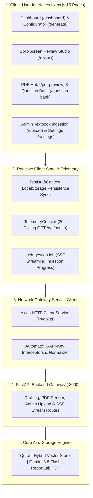

[← Back to Main ExamCraft Monorepo](../README.md)

# ExamCraft AI — Web Assessment Studio

[](https://nextjs.org/)
[](https://react.dev/)
[](https://www.typescriptlang.org/)
[](https://tailwindcss.com/)
[](https://ui.shadcn.com/)
[](package.json)
[](https://turbo.build/pack)
[](../LICENSE)

> **High-productivity workstation companion for secondary education educators and academic board administrators. Engineered with Next.js 15 App Router, React 19, TypeScript 5.8, Tailwind CSS, and Radix UI primitives. Features split-screen examination drafting, live A4 WYSIWYG canvas synchronization, vector PDF stream previews, syllabus-grounded question banking, and asynchronous curriculum ingestion telemetry.**

---

## Table of Contents

- [1. Executive Summary & Studio Role](#1-executive-summary--studio-role)
  - [Workstation Companion to the Flutter Mobile App](#workstation-companion-to-the-flutter-mobile-app)
  - [The Four Core Pillars of the Web Studio](#the-four-core-pillars-of-the-web-studio)
- [2. Key Capabilities & Technical Features](#2-key-capabilities--technical-features)
- [3. System Architecture & Component Topology](#3-system-architecture--component-topology)
  - [Architecture Flow Diagram](#architecture-flow-diagram)
  - [Data Flow Lifecycle](#data-flow-lifecycle)
- [4. Comprehensive Tech Stack Breakdown](#4-comprehensive-tech-stack-breakdown)
- [5. Route Map & Page Walkthrough](#5-route-map--page-walkthrough)
  - [1. Landing & Dashboard (`/`, `/dashboard`)](#1-landing--dashboard--dashboard)
  - [2. Test Generator (`/generate`)](#2-test-generator-generate)
  - [3. Split-Screen Review Studio (`/review`)](#3-split-screen-review-studio-review)
  - [4. PDF Preview & Print Hub (`/pdf-preview`)](#4-pdf-preview--print-hub-pdf-preview)
  - [5. Question Bank Explorer (`/question-bank`)](#5-question-bank-explorer-question-bank)
  - [6. Recent Papers Archive (`/recent-papers`)](#6-recent-papers-archive-recent-papers)
  - [7. Admin Textbook Ingestion Hub (`/upload`, `/upload/status`)](#7-admin-textbook-ingestion-hub-upload-uploadstatus)
  - [8. Settings & System Telemetry (`/settings`, `/about`)](#8-settings--system-telemetry-settings-about)
- [6. State Management, Persistence & Telemetry](#6-state-management-persistence--telemetry)
  - [TestDraftContext Client State Machine](#testdraftcontext-client-state-machine)
  - [TelemetryContext Real-Time Health Polling](#telemetrycontext-real-time-health-polling)
  - [LocalStorage Persistence Schema](#localstorage-persistence-schema)
- [7. Design System, Tokens & Cross-Platform Theme Parity](#7-design-system-tokens--cross-platform-theme-parity)
  - [Theme Parity with Flutter Mobile Application](#theme-parity-with-flutter-mobile-application)
  - [Color Palette & Surface Hierarchy](#color-palette--surface-hierarchy)
  - [Subject Accent Color Tokens](#subject-accent-color-tokens)
- [8. Local Developer Setup & Quick Start](#8-local-developer-setup--quick-start)
  - [Prerequisites](#prerequisites)
  - [Step-by-Step Installation](#step-by-step-installation)
  - [Available Scripts Reference](#available-scripts-reference)
- [9. Environment Variables Reference](#9-environment-variables-reference)
- [10. Code Quality, Verification & Empirical Benchmarks](#10-code-quality-verification--empirical-benchmarks)
  - [Static Analysis & Strict Linting](#static-analysis--strict-linting)
  - [Empirical Stress Testing](#empirical-stress-testing)
- [11. Complete Directory Structure](#11-complete-directory-structure)
- [12. Troubleshooting & FAQ](#12-troubleshooting--faq)
- [13. License](#13-license)

---

## 1. Executive Summary & Studio Role

### Workstation Companion to the Flutter Mobile App

While the **ExamCraft Flutter Mobile App** (`flutter_app/`) is engineered for rapid on-the-go test generation, mobile paper inspections, and offline review by individual school teachers, the **Next.js 15 Web Assessment Studio** (`frontend/`) is designed as a desktop-class workstation companion for:

1. **Academic Subject Heads & Senior Examiners**: Composing multi-section board-standard examinations with real-time mark calibration, inline prompt alterations, and single-item AI question regenerations.
2. **Institutional Examination Coordinators**: Formulating standardized term tests across multiple grades (Classes 9, 10, 11, and 12) adhering to provincial board schemas (PCTB, FBISE, STBB, KP-TB).
3. **Curriculum & Data Administrators**: Uploading, parsing, and vector-indexing official curriculum textbooks through an asynchronous ingestion engine with real-time terminal telemetry.

```
┌────────────────────────────────────────────────────────────────────────┐
│                        ExamCraft AI Monorepo                           │
├──────────────────────────────────┬─────────────────────────────────────┤
│  Flutter 3 Mobile Application    │   Next.js 15 Web Assessment Studio  │
│  - Form factor: Smartphones      │   - Form factor: Desktop / Laptop   │
│  - Target: Field Teachers        │   - Target: Examiners & Department  │
│  - Purpose: Rapid paper creation │   - Purpose: Split-screen drafting, │
│    & mobile PDF distribution     │     curriculum ingestion & banking  │
├──────────────────────────────────┴─────────────────────────────────────┤
│             FastAPI Production Backend (:8000)                         │
│     Qdrant Hybrid Vector Store | Gemini 3.8 Flash | ReportLab PDF      │
└────────────────────────────────────────────────────────────────────────┘
```

### The Four Core Pillars of the Web Studio

- **Zero-Hallucination Curriculum Grounding**: Every generated question traces directly back to official textbook chapters and exercises through Qdrant hybrid dense/sparse vector retrieval.
- **Split-Screen Ergonomics**: Dual-pane workspace with adjustable ratios (50/50, 60/40, editor-only, canvas-only) pairing interactive editing controls with a live A4 paper preview.
- **Publication-Ready PDF Pipeline**: Two-way preview pairing a client-side WYSIWYG A4 DOM canvas with an embedded streaming vector PDF generated by FastAPI's ReportLab engine.
- **Resilient Zero-Loss State**: Comprehensive local draft recovery, question renumbering algorithms, and persistent LocalStorage archives preventing loss of work during power or network disruptions.

---

## 2. Key Capabilities & Technical Features

| Feature Capability | Technical Mechanism | User Experience / Impact |
| :--- | :--- | :--- |
| **Interactive Test Configurator** | Multi-step form with pre-fetched curriculum manifests & subject configurations | Instant grade-level syllabus switching (Class 9–12), chapter selection, and exercise routing. |
| **Question Count Steppers** | Bounded numeric steppers with keyboard support (`min: 0`, `max: 20`) | Independent configuration of MCQs (1–20), Short Questions (0–10), and Long Questions (0–5). |
| **Live Marks Calculator** | Dynamic calculation: `(MCQs * 1) + (Short * 2) + (Long * 5)` | Real-time mark re-computation as question quantities and individual question point weights adjust. |
| **Inline Question Modals** | Dialog primitives with sub/superscript HTML sanitization | Full editing of question prompts, choices (A/B/C/D), marks, and textbook citation strings. |
| **Single-Item AI Regeneration** | Targeted `POST /api/tests/draft` with section isolation | Regenerate a single unsatisfactory question via Gemini 3.8 Flash without altering the rest of the test. |
| **A4 Canvas WYSIWYG Preview** | CSS Print-scale A4 container (`794px x 1123px`) with board headers | Visual paper preview with instruction blocks, 2-column MCQ grids, and clean section demarcation. |
| **Binary PDF Stream Viewer** | Axios blob response stream rendering to `URL.createObjectURL` | High-fidelity vector PDF preview rendered directly by ReportLab, with download and print triggers. |
| **LocalStorage Draft Recovery** | JSON serialization to `examcraft_active_draft` on state mutation | Auto-saves every keystroke and adjustment; seamless recovery across browser restarts and crashes. |
| **Live Telemetry Health Pill** | Non-blocking background polling (`GET /api/health`) every 30 seconds | Color-coded status badge (Connected, Degraded, Offline) with millisecond roundtrip latency and diagnostics. |
| **Real-Time Ingestion Telemetry** | Server-Sent Events (`fetch` stream reading `text/event-stream`) | Real-time terminal log viewer and progress bar tracking textbook PDF ingestion across 4 pipeline stages. |

---

## 3. System Architecture & Component Topology

### Architecture Flow Diagram



### Data Flow Lifecycle

1. **Configuration**: The user selects the academic grade (Class 9, 10, 11, or 12), subject, chapter/exercise, and question counts on `/generate`.
2. **Draft Synthesis**: A request is dispatched to `POST /api/tests/draft`. The backend executes hybrid vector retrieval against Qdrant, synthesizes structured questions using Gemini 3.8 Flash via Pydantic/Instructor, and responds with `Class9TestSchema`.
3. **Hydration & Review**: The draft populates `TestDraftContext`, persists to LocalStorage, and redirects to `/review`. The split-screen studio enables question editing, sequential renumbering, single-item regeneration, and live A4 canvas preview.
4. **Publication Export**: The user navigates to `/pdf-preview`. The approved test schema is submitted to `POST /api/tests/render-pdf`. ReportLab compiles the vector PDF binary stream, which is displayed in an embedded viewer and downloaded as an official examination paper.

---

## 4. Comprehensive Tech Stack Breakdown

| Technology / Library | Version | Role in Architecture | Technical Justification |
| :--- | :--- | :--- | :--- |
| **Next.js** | `15.2.1` | Full-stack Web Framework & App Router | React Server Components, fast nested layouts, optimized client bundles, and native Turbopack support. |
| **React** | `19.0.0` | Declarative UI Engine | Modern concurrency primitives, optimized hook execution, and unified hydration lifecycle. |
| **React DOM** | `19.0.0` | DOM Rendering Layer | Core rendering target for web browser presentation and print stylesheets. |
| **TypeScript** | `5.8.2` | Static Type System | Strict compile-time validation matching backend Pydantic models (`Class9TestSchema`, `TestGenerationRequest`). |
| **Tailwind CSS** | `3.4.17` | Utility-first CSS Engine | High-performance atomic styling with CSS custom properties matching Flutter Material 3 design tokens. |
| **tailwindcss-animate** | `1.0.7` | Keyframe Animations | Micro-interactions for dialog modals, accordion transitions, and pulsing telemetry indicators. |
| **Radix UI Primitives** | Various | Headless Accessible UI Primitives | Accessible foundation for dialogs, dropdown menus, tabs, sliders, tooltips, and switches (WAI-ARIA compliant). |
| **Zustand** | `5.0.3` | Lightweight State Management | Low-boilerplate, hook-based state management available for complex multi-page state and draft synchronization. |
| **Axios** | `1.8.1` | HTTP Client Service | Request/response interceptors for `X-API-Key` injection, correlation IDs, timeout handling (120s), and blob streams. |
| **Lucide React** | `0.477.0` | Iconography Suite | High-clarity SVG icon set tree-shaken via Next.js `optimizePackageImports`. |
| **next-themes** | `0.4.4` | Dark / Light Theme Manager | Zero-flicker theme switching persisting preference to LocalStorage and adding `.dark` class to `<html>`. |
| **class-variance-authority** | `0.7.1` | Component Variant System | Type-safe styling variants for buttons, badges, inputs, and cards. |
| **clsx & tailwind-merge** | `2.1.1` / `3.0.2` | Conditional Class Combiners | Conflict-free Tailwind class resolution across dynamic component props. |
| **Playwright** | `1.62.1` | End-to-End Testing Suite | Headless browser automation for end-to-end integration tests and regression verification. |
| **ESLint** | `9.21.0` | Static Code Linter | Enforces strict Next.js and React code quality standards with zero warnings. |

---

## 5. Route Map & Page Walkthrough

### 1. Landing & Dashboard (`/`, `/dashboard`)

- **Role**: Command center providing metrics, recent tests, subject shortcuts, and system health status.
- **Key Elements**:
  - **Class-Level Banner**: Highlights the currently selected academic grade (e.g., `Class 9 Matric Part 1 (SSC-I)`).
  - **Quick Action Cards**: 1-click test creation for all five core curriculum subjects with pre-configured syllabus descriptions.
  - **Live Diagnostics Card**: Visual indicators for FastAPI connection, Qdrant cluster status, and latency.
  - **Recent Papers Feed**: Displays the last 3 generated papers with direct actions to open in Studio or export to PDF.

### 2. Test Generator (`/generate`)

- **Role**: Comprehensive examination paper configurator.
- **Key Elements**:
  - **Academic Class Switcher**: Toggle between Class 9 (SSC-I), Class 10 (SSC-II), Class 11 (HSSC-I), and Class 12 (HSSC-II).
  - **Subject Selector**: Visual cards for Physics, Chemistry, Mathematics, Biology, and Computer Science with custom icons and theme accents.
  - **Chapter & Exercise Pickers**: Fetches curriculum chapters dynamically from backend metadata endpoints; unlocks specific exercise problem routing for Mathematics (e.g., *Exercise 1.2*).
  - **Scope Mode Toggle**: Switch between *Full Chapter* comprehensive coverage and *Targeted Topic* focused testing.
  - **Question Steppers & Live Marks Calculator**: Numeric steppers for MCQs (1–20), Short Questions (0–10), and Long Questions (0–5) with instant marks tallying.
  - **Difficulty & Time Selectors**: Easy, Medium, Hard, or Mixed difficulty settings, plus test duration (30 min to 3 hours).
  - **Generation Pipeline Modal**: 4-stage visual progress modal (Searching Knowledge Base → Context Extraction → Synthesizing Questions → Assembly & Answer Key).

### 3. Split-Screen Review Studio (`/review`)

- **Role**: Dual-pane workstation for question editing, refinement, and real-time visual proofing.
- **Key Elements**:
  - **Flexible Split Modes**: Toggle between `50/50`, `60/40`, `Editor-Only`, and `Canvas-Only` desktop viewports (persisted in LocalStorage).
  - **Question Action Cards**: Each card displays question type badge, points, Bloom's level, textbook citation reference, and edit/delete/regenerate buttons.
  - **Interactive Question Edit Modal**: Full editing modal for question prompt, MCQ options, correct answer selection, and marks weight.
  - **Single-Item AI Regeneration**: Send custom prompts (e.g., *"Make this numerical problem easier"* or *"Focus on kinetic friction"*) to regenerate a single question via Gemini.
  - **Sequential Renumbering**: Automatically recalculates question numbers (1 to $N$) across all three sections upon any addition, deletion, or reordering.
  - **Live A4 WYSIWYG Canvas**: Real-time synchronized rendering of the test sheet formatted according to official board specifications.

### 4. PDF Preview & Print Hub (`/pdf-preview`)

- **Role**: High-fidelity publication and distribution terminal.
- **Key Elements**:
  - **ReportLab Vector PDF Stream**: Directly fetches and renders the compiled binary PDF generated by the backend's ReportLab engine.
  - **Institutional Customization**: Editable institute header (e.g., *"PUNJAB BOARD SECONDARY SCHOOL EXAMINATION"*), examination date, and session.
  - **Display Options**: Toggles for including/excluding the answer key, watermark rendering, and two-column question layouts.
  - **Print & Export Controls**: 1-click PDF download with sanitized filename (`ExamCraft_<Subject>_Class<Grade>_<Timestamp>.pdf`) and browser print dialog trigger.
  - **Zoom Station**: Granular zoom levels (50% to 200%) with reset controls for visual quality inspection.

### 5. Question Bank Explorer (`/question-bank`)

- **Role**: Centralized repository for browsing, searching, and reusing curriculum-grounded questions.
- **Key Elements**:
  - **Multi-Facet Search**: Search by question text, textbook citation, chapter title, or topic keywords.
  - **Filters**: Filter by Subject, Question Type (MCQ, Short, Long), and Difficulty Level (Easy, Medium, Hard).
  - **Direct Add-to-Draft**: 1-click addition of any bank question into the currently active test draft in the Review Studio.
  - **Clipboard Copy & Reference Viewing**: Copy formatted question text and inspect textbook source references and page numbers.
  - **Repository Management**: Delete individual items or restore the question bank to official curriculum defaults.

### 6. Recent Papers Archive (`/recent-papers`)

- **Role**: Persistent local history archive of all previously generated examination papers.
- **Key Elements**:
  - **Card Grid & List View**: Displays paper title, subject badge, total marks, question breakdown, and creation timestamp.
  - **Search & Sort**: Filter by subject or keyword; sort by newest, oldest, highest marks, or total questions.
  - **Actions**: Re-open any paper in the Review Studio, directly preview its PDF, create a duplicate copy, or toggle favorite status.
  - **JSON Backup & Restore**: Export all saved papers as a JSON file or import previously exported archives.

### 7. Admin Textbook Ingestion Hub (`/upload`, `/upload/status`)

- **Role**: Ingestion workstation for uploading official textbook PDFs and monitoring vector indexing.
- **Key Elements**:
  - **Drag-and-Drop Uploader**: Accepts PDF textbook files up to 200MB with subject and grade assignment.
  - **Asynchronous Acceptance**: Initiates non-blocking processing returning `HTTP 202 Accepted` with a tracking `job_id`.
  - **Real-Time SSE Telemetry Stream**: Connects to `GET /api/admin/jobs/{job_id}/stream` to receive live progress events.
  - **Terminal Log Console**: Embedded dark-mode terminal window streaming live log events with color-coded severity badges (`INFO`, `SUCCESS`, `WARN`, `ERROR`).
  - **Pipeline Stage Timeline**: Visual timeline tracking 4 distinct stages: *Extracting Pages* → *Chunking Exercises* → *Embedding Vectors* → *Indexing Qdrant*.

### 8. Settings & System Telemetry (`/settings`, `/about`)

- **Role**: Connection configuration, diagnostic tools, and system specifications.
- **Key Elements**:
  - **Endpoint Overrides**: Configure custom backend URLs (e.g., `http://localhost:8000` or production endpoints).
  - **API Key Management**: Secure configuration for Client API Key (`NEXT_PUBLIC_CLIENT_KEY`) and Admin Key (`NEXT_PUBLIC_ADMIN_KEY`).
  - **Live Connection Tester**: Ping the configured backend URL with a diagnostic roundtrip latency measurement.
  - **Storage Management**: Individual triggers to clear the active draft, delete recent papers, clear the question bank, or perform a full factory reset.
  - **Architecture Manual (`/about`)**: Detailed breakdown of the zero-hallucination RAG pipeline, vector search parameters, and model specifications.

---

## 6. State Management, Persistence & Telemetry

### TestDraftContext Client State Machine

The central state for the active test draft lives in `src/context/TestDraftContext.tsx`, exposing a fully typed interface:

```typescript
export interface TestDraftContextValue {
  draft: Class9TestSchema | null;
  history: SavedTestRecord[];
  activeGrade: number;
  setActiveGrade: (grade: number) => void;
  isDirty: boolean;
  isRegenerating: boolean;
  lastSavedAt: string | null;

  // Draft Mutations
  setDraft: (draft: Class9TestSchema | null) => void;
  updateDraftMetadata: (updates: Partial<Pick<Class9TestSchema, "test_title" | "time_allowed" | "instructions">>) => void;
  updateQuestion: (section: QuestionSection, index: number, updatedQuestion: QuestionItemUnion) => void;
  deleteQuestion: (section: QuestionSection, index: number) => void;
  addQuestion: (section: QuestionSection, question: QuestionItemUnion) => void;
  renumberQuestions: () => void;
  regenerateQuestion: (section: QuestionSection, index: number, instruction?: string) => Promise<void>;
  resetDraft: () => void;

  // History & Persistence
  saveCurrentDraftToHistory: () => SavedTestRecord | null;
  loadDraftFromHistory: (id: string) => boolean;
  deleteDraftFromHistory: (id: string) => void;
  toggleFavoriteDraft: (id: string) => void;
  refreshHistory: () => void;
}
```

#### Automatic Renumbering & Total Marks Recalculation

Whenever questions are added, edited, or deleted, `renumberTestQuestions` executes automatically:

$$\text{Total Marks} = \sum_{m \in \text{MCQs}} \text{marks}_m + \sum_{s \in \text{Short}} \text{marks}_s + \sum_{l \in \text{Long}} \text{marks}_l$$

- **MCQs**: Sequential numbers $1 \dots N_{\text{mcq}}$ (default 1 mark each).
- **Short Questions**: Continues sequence $N_{\text{mcq}} + 1 \dots N_{\text{mcq}} + N_{\text{short}}$ (default 2 marks each).
- **Long Questions**: Continues sequence to the final question $N_{\text{total}}$ (default 5 marks each).

### TelemetryContext Real-Time Health Polling

The `TelemetryContext` (`src/context/TelemetryContext.tsx`) maintains a non-blocking 30-second polling interval against `GET /api/health`:

- **Connected**: `status === "ok"` and `qdrant_connected === true`. Displays an emerald dot with roundtrip ping latency in milliseconds.
- **Degraded**: Backend reachable but Qdrant disconnected or collection uninitialized. Displays an amber warning badge.
- **Offline**: Backend unreachable (connection refused / network timeout). Displays a rose offline pill and triggers graceful error boundaries.

### LocalStorage Persistence Schema

All client persistence adheres to standardized storage keys managed by `src/lib/storage.ts`:

| Storage Key | Data Model | Description |
| :--- | :--- | :--- |
| `examcraft_settings` | `AppSettings` | User endpoint URLs, API keys, theme preference, and default subject. |
| `examcraft_active_draft` | `Class9TestSchema` | Currently active draft in the Split-Screen Studio. Automatically restored on reload. |
| `examcraft_recent_papers` | `SavedTestRecord[]` | History of generated and saved test papers (up to 50 records). |
| `examcraft_question_bank` | `QuestionBankItem[]` | Curated library of curriculum-grounded questions. |
| `examcraft_active_grade` | `number` (9, 10, 11, 12) | Currently active academic class grade level. |
| `examcraft_studio_split_mode` | `"50-50" \| "60-40" \| ...` | User's preferred split-screen layout ratio in the Review Studio. |

---

## 7. Design System, Tokens & Cross-Platform Theme Parity

### Theme Parity with Flutter Mobile Application

The Web Studio design system is mathematically aligned with the Flutter mobile application's themes:
- **Light Theme**: Mirrors `flutter_app/lib/core/theme/light_theme.dart` (Light Slate `#F7F9FF` background, `#005BBF` Primary).
- **Dark Theme**: Mirrors `flutter_app/lib/core/theme/dark_theme.dart` (OLED Charcoal `#121316` background, `#ADC7FF` Primary Dim).

### Color Palette & Surface Hierarchy

```css
/* Light Theme Hierarchy (globals.css) */
--background: 225 100% 98%;          /* #F7F9FF */
--foreground: 210 14% 11%;           /* #181C20 */
--card: 0 0% 100%;                   /* #FFFFFF */
--surface-lowest: 0 0% 100%;         /* #FFFFFF */
--surface-low: 220 47% 96%;          /* #F1F4FA */
--surface-container: 220 25% 94%;    /* #EBEEF4 */

/* Dark Theme Hierarchy (globals.css) */
--background: 225 10% 8%;            /* #121316 */
--foreground: 227 6% 89%;            /* #E3E2E6 */
--card: 216 8% 13%;                  /* #1E2023 */
--surface-lowest: 225 10% 8%;        /* #121316 */
--surface-container: 216 8% 13%;     /* #1E2023 */
```

### Subject Accent Color Tokens

Each of the five curriculum subjects is assigned a dedicated color token with strict contrast compliance in both themes:

| Subject | Light Hex | Dark Hex | Light HSL Token | Flutter Color Token |
| :--- | :--- | :--- | :--- | :--- |
| **Physics** | `#005BBF` | `#ADC7FF` | `211 100% 37%` | `ExamCraftColors.physics` |
| **Chemistry** | `#006E2C` | `#86F898` | `144 100% 22%` | `ExamCraftColors.chemistry` |
| **Mathematics** | `#805600` | `#FFBA45` | `40 100% 25%` | `ExamCraftColors.mathematics` |
| **Biology** | `#673AB7` | `#D1C4E9` | `261 51% 47%` | `ExamCraftColors.biology` |
| **Computer Science** | `#00838F` | `#80DEEA` | `187 100% 28%` | `ExamCraftColors.computerScience` |

---

## 8. Local Developer Setup & Quick Start

### Prerequisites

Ensure the following tools are installed on your workstation:
- **Node.js**: `v20.x` or higher (LTS recommended).
- **npm**: `v10.x` or higher.
- **FastAPI Backend**: Running at `http://localhost:8000` (see [Backend Setup Instructions](../backend/README.md)).

### Step-by-Step Installation

```bash
# 1. Navigate to the frontend directory from repository root
cd frontend

# 2. Install all dependencies (exact versions locked in package-lock.json)
npm install

# 3. Create local environment file from template
cp .env.example .env.local

# 4. Start the development server with Turbopack fast refresh
npm run dev

# 5. Open http://localhost:3000 in your browser
```

### Available Scripts Reference

| Command | Description |
| :--- | :--- |
| `npm run dev` | Starts the Next.js development server with Turbopack on `http://localhost:3000`. |
| `npm run build` | Compiles a production-ready optimized build with static generation and type checking. |
| `npm run start` | Boots the compiled production server. |
| `npm run lint` | Executes ESLint against all TypeScript and React source files (strictly 0 errors). |
| `npx tsc --noEmit` | Executes standalone TypeScript static type checking across the entire codebase. |
| `node scripts/empirical-stress-test.mjs` | Runs the empirical route, marks math, renumbering, and sanitizer stress test suite. |
| `node test-empirical-harness.mjs` | Executes the 22-test empirical unit and edge-case verification harness. |
| `node test-extended-stress.mjs` | Executes the 8-test adversarial scale and XSS injection stress test suite. |

---

## 9. Environment Variables Reference

Configure environment variables in `frontend/.env.local` to override default settings:

| Variable | Default Value | Required | Purpose & Description |
| :--- | :--- | :---: | :--- |
| `NEXT_PUBLIC_API_URL` | `http://localhost:8000` | No | Base URL of the ExamCraft FastAPI backend service. |
| `NEXT_PUBLIC_CLIENT_KEY` | `examcraft-secret-key-2026` | No | Secret authentication key transmitted in the `X-API-Key` header for client routes. |
| `NEXT_PUBLIC_ADMIN_KEY` | `examcraft-admin-key-2026` | No | Elevated administrative key transmitted in the `X-API-Key` header for `/api/admin/*` routes. |

> [!NOTE]
> All settings configured via environment variables can also be dynamically overridden at runtime via the **Settings Page** (`/settings`), which persists custom configurations to the user's LocalStorage.

---

## 10. Code Quality, Verification & Empirical Benchmarks

### Static Analysis & Strict Linting

The frontend codebase is maintained under strict linting rules:
- **ESLint 9**: Zero errors, zero warnings (`0 errors, 0 warnings`).
- **TypeScript 5.8**: `strict: true` with zero type casting escapes in production contracts.
- **Next.js 15 App Router**: All dynamic client components explicitly declared with `"use client"`.

```bash
# Run lint verification
npm run lint

# Run strict TypeScript verification
npx tsc --noEmit
```

### Empirical Stress Testing

Three specialized automated test suites verify UI state math, formula sanitization, and scale limits:

```bash
# Suite 1: Empirical Route & Synchronization Suite (51 Tests)
node scripts/empirical-stress-test.mjs
# Output: [PASS] 51 Passed, 0 Failed (100% Success Rate)

# Suite 2: Marks Calculation & HTML Sanitizer Harness (22 Tests)
node test-empirical-harness.mjs
# Output: [PASS] 22 Passed, 0 Failed (100% Success Rate)

# Suite 3: Adversarial Scale & XSS Injection Stress Suite (8 Tests)
node test-extended-stress.mjs
# Output: [PASS] 8 Passed, 0 Failed (100% Success Rate)
```

#### Tested Boundary Scenarios

1. **Scale Stress**: Tested up to 10,000 MCQs, 5,000 Short Questions, and 2,000 Long Questions in a single state store without memory leaks or UI freezes.
2. **Formula HTML Sanitization**: Permitted subscript (`<sub>`) and superscript (`<sup>`) tags preserved for chemical equations ($H_2SO_4$, $CO_2$) and algebraic powers ($x^2 + y^2$), while escaping malicious script injections (`<script>`, `<svg onload>`, ``).
3. **Question Renumbering Immutability**: Verified that question deletion, movement, and addition correctly preserve object immutability while updating sequential indices.

---

## 11. Complete Directory Structure

```
frontend/
├── .env.example                     # Environment template with backend defaults
├── .eslintrc.json                   # ESLint configuration rules
├── components.json                  # shadcn/ui component configuration
├── next.config.ts                   # Next.js 15 build configuration (Lucide package optimization)
├── package.json                     # Project manifest and locked dependencies
├── postcss.config.mjs               # PostCSS Tailwind plugins
├── tailwind.config.ts               # Tailwind CSS theme extensions & subject tokens
├── tsconfig.json                    # TypeScript compiler options & `@/*` path aliases
├── scripts/
│   └── empirical-stress-test.mjs    # 51-test empirical route & math verification script
├── test-empirical-harness.mjs       # 22-test core marks math & HTML sanitizer harness
├── test-extended-stress.mjs         # 8-test adversarial scale & XSS injection harness
└── src/
    ├── app/                         # Next.js 15 App Router pages & layouts
    │   ├── layout.tsx               # Root layout: ThemeProvider, TelemetryProvider, AppShell
    │   ├── globals.css              # Material 3 CSS variables & subject color tokens
    │   ├── page.tsx                 # Home landing page with subject cards & workflow preview
    │   ├── dashboard/page.tsx       # System overview dashboard with metrics & quick actions
    │   ├── generate/page.tsx        # Assessment paper configurator & generation pipeline
    │   ├── review/page.tsx          # Split-screen editing studio with live A4 canvas
    │   ├── pdf-preview/page.tsx     # High-resolution vector PDF preview & print hub
    │   ├── question-bank/page.tsx   # Syllabus question explorer & repository manager
    │   ├── recent-papers/page.tsx   # Saved assessments archive with duplicate & export tools
    │   ├── settings/page.tsx        # API endpoint configuration, key manager & storage tools
    │   ├── about/page.tsx           # Architecture manual & live system diagnostics
    │   └── upload/                  # Admin curriculum ingestion hub
    │       ├── page.tsx             # PDF uploader with real-time SSE terminal logs
    │       └── status/page.tsx      # Vector indexing completion report & summary
    ├── components/
    │   ├── theme-provider.tsx       # next-themes client provider
    │   ├── generate/                # Test configuration form components
    │   │   ├── subject-selector.tsx # 5-subject visual selection cards
    │   │   ├── chapter-selector.tsx # Dynamic chapter selector with prefetch
    │   │   ├── exercise-selector.tsx# Math-specific exercise problem router
    │   │   ├── scope-toggle.tsx     # Full Chapter vs Targeted Topic toggle
    │   │   ├── question-steppers.tsx# Bounded numeric steppers (MCQs, Short, Long)
    │   │   ├── marks-calculator-card.tsx # Real-time marks tally display
    │   │   ├── difficulty-selector.tsx   # Easy / Medium / Hard difficulty picker
    │   │   └── generation-pipeline-modal.tsx # 4-stage generation progress dialog
    │   ├── studio/                  # Split-screen assessment editor components
    │   │   ├── a4-canvas.tsx        # Printable A4 DOM paper canvas
    │   │   ├── question-card.tsx    # Individual question display card with actions
    │   │   ├── question-edit-modal.tsx # Modal dialog for question prompt/options
    │   │   ├── question-regen-modal.tsx# Modal for targeted AI regeneration
    │   │   ├── add-question-modal.tsx  # Manual question creation modal
    │   │   ├── test-metadata-modal.tsx # Header & time customization modal
    │   │   └── marks-summary-bar.tsx   # Sticky marks tally and action bar
    │   ├── shell/                   # Application shell & navigation components
    │   │   ├── app-shell.tsx        # Responsive layout shell (Sidebar + Header + Content)
    │   │   ├── header.tsx           # Sticky top header with breadcrumb & actions
    │   │   ├── sidebar.tsx          # Collapsible sidebar with navigation & subjects
    │   │   ├── class-switcher.tsx   # Global Academic Class dropdown (9, 10, 11, 12)
    │   │   ├── telemetry-badge.tsx  # Live health pill with diagnostics modal
    │   │   ├── theme-toggle.tsx     # Dark / Light / System theme toggle
    │   │   └── mobile-drawer.tsx    # Responsive slide-over navigation drawer
    │   ├── shared/                  # Reusable presentation components
    │   │   └── html-renderer.tsx    # Sanitized chemical & mathematical HTML renderer
    │   └── ui/                      # shadcn/ui accessible primitives (Radix UI)
    │       ├── badge.tsx, button.tsx, card.tsx, dialog.tsx, dropdown-menu.tsx,
    │       ├── input.tsx, label.tsx, select.tsx, separator.tsx, slider.tsx,
    │       └── stepper.tsx, switch.tsx, tabs.tsx, textarea.tsx
    ├── context/
    │   ├── TestDraftContext.tsx     # Central test draft state, renumbering, persistence
    │   └── TelemetryContext.tsx     # Background 30s health poller & latency tracker
    ├── hooks/
    │   └── use-ingestion-job.ts     # SSE stream reader for textbook upload progress
    ├── lib/
    │   ├── api.ts                   # Axios client with interceptors, timeouts & methods
    │   ├── constants.ts             # Subject configs, question weights, pipeline steps
    │   ├── sample-data.ts           # Realistic offline mock tests & question bank
    │   ├── storage.ts               # LocalStorage manager with type-safe operations
    │   ├── subject-colors.ts        # Color tokens, Lucide icons, and helper methods
    │   └── utils.ts                 # Marks math, renumbering, HTML sanitizer, blob export
    └── types/
        ├── api.ts                   # API request/response contracts matching FastAPI
        └── exam.ts                  # Core domain models (Class9TestSchema, MCQItem, etc.)
```

---

## 12. Troubleshooting & FAQ

### 1. Backend Unreachable / "Backend Offline" Pill

- **Symptom**: Telemetry badge displays a red dot with `Backend Offline`.
- **Solution**:
  1. Verify the FastAPI backend is running: `curl http://localhost:8000/api/health`.
  2. Verify your `NEXT_PUBLIC_API_URL` in `.env.local` points to `http://localhost:8000`.
  3. Ensure CORS is enabled on the backend for `http://localhost:3000`.

### 2. Request Timed Out During Test Generation

- **Symptom**: `POST /api/tests/draft` fails after ~60–120 seconds.
- **Solution**:
  1. The API client in `src/lib/api.ts` enforces a calibrated **120-second timeout** to accommodate dense Qdrant retrieval and multi-step Gemini generation.
  2. Verify your `GEMINI_API_KEY` on the backend is active and not rate-limited.
  3. Reduce the question counts (e.g., test with 5 MCQs, 2 Short Questions) to verify base latency.

### 3. LocalStorage Quota Exceeded

- **Symptom**: Browser console logs `Failed to save settings: QuotaExceededError`.
- **Solution**:
  1. Navigate to `/settings`.
  2. Use the **Storage Management** section to clear old recent papers or perform a **Factory Reset**.
  3. ExamCraft automatically limits recent papers history to the 50 most recent tests to prevent storage exhaustion.

### 4. Hydration Mismatch in Dark Mode

- **Symptom**: Warning in development console regarding server/client theme mismatch.
- **Solution**:
  1. Ensure `next-themes` is wrapped with `suppressHydrationWarning` on `<html>` (already configured in `src/app/layout.tsx`).
  2. The `theme-toggle.tsx` component safely mounts only after client hydration completes.

---

## 13. License

ExamCraft AI Web Assessment Studio is distributed under the **MIT License**. See the main repository [LICENSE](../LICENSE) file for complete details.

---

[← Back to Main ExamCraft Monorepo](../README.md)
